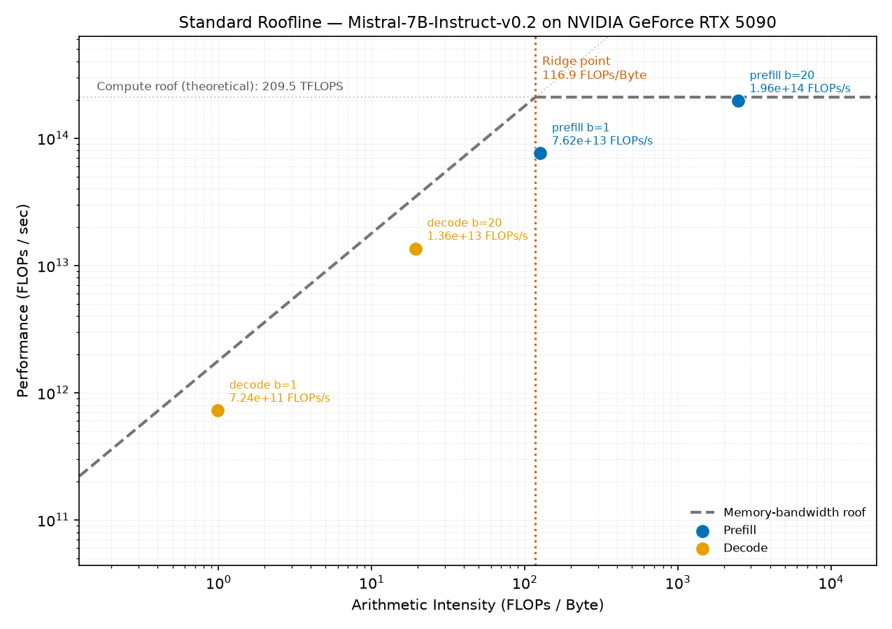
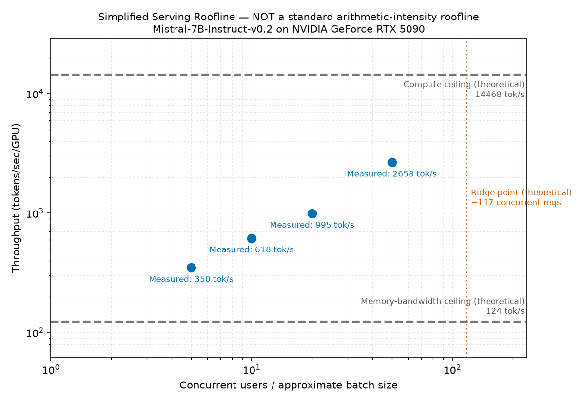

# InferBench

A toolkit for standing up a low-latency LLM inference server and proving it's actually fast: run a persistent vLLM server on a RunPod GPU pod, hammer it with concurrent requests from your own machine, and measure real latency, throughput, and GPU roofline limits — the same kind of benchmarking you'd want before building a production-grade, low-latency API on top of it.

## Setup

This project defaults to and has been benchmarked with **`mistralai/Mistral-7B-Instruct-v0.2`** (change it via `MODEL_NAME` in `.env` or `--model` on `load_test.py`).

1. Deploy a GPU pod on RunPod with SSH enabled (1 GPU, 24GB+ VRAM recommended for a 7B model).
2. Copy `.env.example` to `.env` and fill in your pod's SSH host, port, key path, and the model you want to serve.
3. `./serve.sh` — installs vLLM on the pod, starts it, and tunnels its port to `localhost`. Leave this running.

## Usage

In a second terminal (with `serve.sh` still running):

- **Single request:** `python client.py "your prompt here"`
- **Concurrent load test:** `python load_test.py --users 20`

`load_test.py` fires N requests at the server at the same time (via a thread pool, streaming responses) and prints total time, average latency, average TTFT, average ITL, requests/sec, and actual completion tokens/sec (from the API's real `usage` field, not estimated). By default it cycles through the sample prompts in `prompts.json`; pass a prompt explicitly (`python load_test.py "..." --users 20`) to send that one prompt to every request instead.

Every parameter is overridable via CLI flags (`--users`, `--max-tokens`, `--model`, `--host`, `--port`) and otherwise falls back to `.env`.

## Results

Each `load_test.py` run appends a row (timestamp, model, users, max_tokens, total_s, avg_latency_s, avg_ttft_s, avg_itl_s, requests_per_s, completion_tokens, prompt_tokens, total_tokens, actual_tokens_per_sec, errors) to `results/load_test.csv`, so you can compare runs across models, GPU types, or user counts. This file isn't committed to git.

## Roofline analysis

A [roofline model](https://en.wikipedia.org/wiki/Roofline_model) answers one question for a given workload on a given GPU: **is it limited by memory bandwidth or by raw compute?** Plot performance (FLOPs/sec) against arithmetic intensity (FLOPs of work done per byte moved from memory), on log-log axes. Two ceilings bound what's achievable: a **memory roof** (a diagonal line — performance scales with how much bandwidth you have, since you're bottlenecked on data movement) and a **compute roof** (a flat line — you've saturated the GPU's math throughput, more bandwidth wouldn't help). Where they cross is the **ridge point**: workloads to its left are memory-bound, to its right are compute-bound.

For LLM inference specifically, **prefill** (processing a whole prompt at once) tends to land compute-bound — many tokens share the same weight reads. **Decode** (generating one token at a time) tends to land memory-bound — each step re-reads the model's weights and KV cache to produce a single token. The plot below shows exactly this split, measured on this project's actual model and GPU rather than assumed:

`plots/simplified_serving_roofline.png` is a different, non-standard chart kept only for before/after comparison — concurrency vs. throughput, not arithmetic intensity:

Three-step pipeline — run in order, from the repo root:

1. **`python load_test.py --users 20`** (and any other concurrency levels you want) — populates `results/load_test.csv` with real HTTP benchmark data. Requires `serve.sh` running.
2. **`./profile.sh`** — ships `profile_model.py` to the pod, loads the *same model* directly via `transformers` (bypassing the HTTP server), profiles representative prefill/decode forward passes with `torch.profiler`, and pulls back `results/roofline_profile.csv` + `results/ncu_status.txt`. Does **not** require `serve.sh` to be running — it loads the model itself. Also detects the GPU via `nvidia-smi` on the pod (not hardcoded) and looks it up in `hw_specs.py`; fails clearly if the GPU isn't in that table rather than guessing its specs.
3. **`pip install -r requirements.txt`** (matplotlib, local only), then:
   - **`python roofline.py`** — the **standard arithmetic-intensity roofline** (X = FLOPs/Byte, Y = FLOPs/sec, log-log), built from `results/roofline_profile.csv`. Writes `plots/roofline.png` and `results/roofline_analysis.md`.
   - **`python simplified_roofline.py`** — the original concurrency-vs-tokens/sec roofline, kept only for before/after comparison, clearly labeled "NOT a standard arithmetic-intensity roofline." Writes `plots/simplified_serving_roofline.png`.

See `results/roofline_analysis.md` (generated by step 3) for the full methodology: what's measured vs. profiled vs. analytically estimated vs. published theoretical spec, and its limitations — including why this doesn't profile vLLM's live server directly, and whether Nsight Compute (`ncu`) was usable on the pod.

`simplified_roofline.py` reads the GPU name from `results/roofline_profile.csv`, so run `./profile.sh` at least once before it, even if you only care about the simplified plot.

**On published spec accuracy:** `hw_specs.py`'s numbers are manufacturer-published theoretical peaks, and they're easy to get subtly wrong (e.g. quoting a sparse figure instead of dense, or the wrong accumulate mode) — this project's own profiling caught exactly that once: an initial RTX 5090 entry was off by ~2x, discovered because a *measured* point came out above the theoretical compute roof, which is physically impossible. If you add a new GPU to that table, treat "achieved > theoretical peak" in `roofline.py`'s output as a signal to re-check the spec, not the measurement.

## Files

- `serve.sh` — starts the vLLM server on the pod over SSH and tunnels its port locally.
- `client.py` — sends a single prompt to the running server.
- `load_test.py` — sends concurrent streaming requests to simulate multiple users, records real TTFT/ITL/token counts, and logs results.
- `profile.sh` / `profile_model.py` — profiles isolated prefill/decode forward passes of the actual model on the pod with `torch.profiler`.
- `hw_specs.py` — published theoretical peak specs (memory bandwidth, BF16 FLOPS) keyed by detected GPU name.
- `roofline.py` — the standard arithmetic-intensity roofline, from profiled data.
- `simplified_roofline.py` — the original (non-standard) concurrency-vs-throughput roofline, kept for comparison.
- `env.py` — tiny shared helper both Python scripts use to read `.env`.
- `prompts.json` — sample prompts used when no prompt is passed to `load_test.py`.

## Notes

- On very new GPUs (e.g. RTX 50 series / Blackwell, SM 12.x), `serve.sh` sets `VLLM_USE_FLASHINFER_SAMPLER=0` — FlashInfer's sampling kernel doesn't yet support this architecture and crashes on startup otherwise.
- Both `serve.sh` and `profile.sh` install and enable `hf_transfer` before downloading model weights — plain single-connection Hugging Face Hub downloads can be extremely slow (observed well under 1MB/s on a fresh pod) regardless of whether you're authenticated; `hf_transfer` uses parallel connections and fixes this.
- Fresh pods can be tight on disk — a 7B model's weights (~14GB) plus vLLM/PyTorch (~7GB) can fill a small root volume fast. If a pod has a separate larger volume (e.g. `/workspace`), and you hit disk pressure, `pip cache purge` on the pod is a quick, safe way to reclaim a few GB without touching installed packages.
